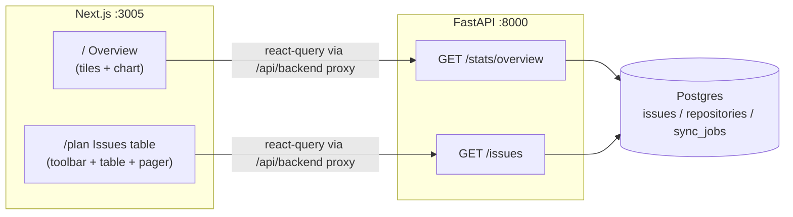

# Slice 4: Live Overview + Spreadsheet Issues Table — Design

**Date:** 2026-07-18
**Status:** Approved design, pre-implementation
**Board:** issue #4 (spreadsheet issues table, P1) + live-Overview precursor agreed 2026-07-18
**Baseline:** main @ 79dfa06 (slices 1–3 merged; 175 issues synced across patelmj/mehova and patelmj/IssueLens)

## Goal

Make the synced data visible. Two surfaces, built in this order:

1. **Live Overview** (`/`) — real stat tiles + one activity chart from synced data,
   replacing the stale "Connect a repository to begin" placeholder.
2. **Spreadsheet issues table** (`/plan`) — the spec §7 sortable/filterable table over
   the `issues` table, scoped to data that exists today.

Plus the slice-4 deferred-findings intake from the sync-slice final review (see §8).

## Decisions (agreed with user)

| Decision | Choice |
|---|---|
| Table write actions (§7.2 bulk edits, inline edit) | **Deferred** — table is read-only this slice; only "open on GitHub" links |
| Table engine | **Hand-rolled** `<table>` + own state; no new dependencies |
| Overview composition | **Tiles + one activity chart** (opened vs closed, last 30 days) |
| Sort/filter/pagination | **Server-side** via query params; SQL does the work |

Rationale for server-side: the table is the workhorse surface later slices build on
(triage, saved views); saved views become serialized query params, and triage reuses the
filter primitives. Client-side would need rework the first time a large repo syncs.

## Non-goals

- No readiness/complexity/risk/type/area columns — scoring intelligence doesn't exist
  yet (spec §6, later slices). The table shows only synced GitHub data.
- No GitHub write path, no inline editing, no bulk actions, no column reorder/freeze,
  no export, no saved views (foundation only: URL-serialized state).
- No auth changes (auth slice), no webhooks, no Analyze page work (board #15).

## 1. Architecture



Both pages follow the repositories-page pattern exactly: `"use client"` component,
react-query, fetches through the `/api/backend/[...path]` proxy, tokens-only styling
(`bg-(--color-X)` syntax), card/btn class conventions from `repositories-client.tsx`.

## 2. Backend

### 2.1 `GET /stats/overview` (new `app/routers/stats.py`)

Single payload for the whole Overview page:

```json
{
  "connected_repos": 2,
  "open_issues": 94,
  "last_synced_at": "2026-07-18T21:04:00Z",
  "top_repos": [
    {"id": 1, "full_name": "patelmj/mehova", "open_issues_count": 80},
    {"id": 2, "full_name": "patelmj/IssueLens", "open_issues_count": 14}
  ],
  "activity": [
    {"date": "2026-06-19", "opened": 3, "closed": 1}
  ]
}
```

- `open_issues` counts `issues` rows `WHERE state = 'open' AND NOT is_pull_request`
  (live count from the issues table, not the repo counter, so it always matches the table).
- `top_repos` = up to 5 repositories ordered by `open_issues_count` desc.
- `activity` = last 30 days, one row per day that has activity: opened from
  `date_trunc('day', gh_created_at)`, closed from `date_trunc('day', gh_closed_at)`,
  PRs excluded. Frontend fills gap days with zeros.
- Empty DB returns zeros/empty arrays — never an error; frontend owns presentation.

### 2.2 `GET /issues` (new `app/routers/issues.py`)

Query params (all optional):

| Param | Values / default | Behavior |
|---|---|---|
| `repo_id` | int | filter to one repository |
| `state` | `open` (default) / `closed` / `all` | issue state |
| `label` | string | JSONB containment: `labels @> [{"name": <label>}]` (labels are stored as `{name, color}` objects) |
| `assignee` | string | JSONB containment: `assignees @> [<login>]` (assignees are stored as login strings) |
| `q` | string | `ILIKE %q%` on title; if `q` is numeric, also matches `number` exactly |
| `sort` | `updated` (default) / `created` / `comments` / `number` / `title` | sort key |
| `order` | `desc` (default) / `asc` | direction |
| `limit` | 50 (max 100) | page size |
| `offset` | 0 | page start |

Response: `{"items": [IssueOut], "total": int, "limit": int, "offset": int}` where
`total` is the filtered count (for the pager). `IssueOut` fields: `id`,
`repository_id`, `repo_full_name` (joined), `number`, `title`, `state`,
`author_login`, `labels`, `assignees`, `milestone_title`, `comments_count`,
`gh_created_at`, `gh_updated_at`, `gh_closed_at`.

Invariant: **every query includes `WHERE is_pull_request = false`** — the REST sync
stores PRs flagged via `is_pull_request`, and no issue-facing surface shows them.

GitHub links are constructed client-side as
`https://github.com/{repo_full_name}/issues/{number}` — no new stored columns.

Unknown `sort`/`state`/`order` values → 422 (validated enums), not silent defaults.

**`GET /issues/facets`** (same router): `repo_id` optional param; returns
`{"labels": [{"name", "color"}], "assignees": [str]}` — distinct values across
non-PR issues (scoped to the repo when given), via `jsonb_array_elements`. Feeds the
toolbar's label/assignee dropdowns so they always reflect real data.

### 2.3 Migration 0003

- Deferred-intake FK indexes: `repositories.installation_id`, `sync_jobs.repository_id`.
- Query-support partial indexes on `issues`: `(gh_updated_at)` and `(state)`, both
  `WHERE NOT is_pull_request` (matches the invariant filter).

### 2.4 Sync dedup (intake)

`_job_id=f"sync-repo-{repo_id}"` on the `POST /repositories/{id}/sync` enqueue, so
repeated clicks/concurrent requests dedup in ARQ (enqueue returns `None` when the job
already exists → the endpoint reports `{"queued": false}`). Note: the reconciliation
cron does **not** enqueue — it calls the sync function inline inside the worker — so
the endpoint is the only enqueue path. (Corrected during planning; the original
design assumed two enqueue paths.)

## 3. Frontend: Overview (`/`)

Replaces `PagePlaceholder`. Layout inside the existing shell:

- **Stat tile row (4 tiles):** Connected repositories · Open issues · Last synced
  (relative time) · Biggest repo (name + open count). Tiles are the standard card
  (14px radius, `--shadow-card`), value in large type, label in tiny uppercase muted —
  per sketch-findings direction and the `dataviz` skill (loaded before implementation).
- **Activity card:** "Opened vs closed — last 30 days". Hand-rolled SVG (no chart
  library): two series with a legend row plus direct ink end-labels (the dataviz
  skill mandates a legend for ≥2 series; direct labels come on top of it, not
  instead of it), tokens-only colors, theme-aware in light and dark.
- **Repos strip:** the `top_repos` list linking to `/repositories` and to each repo's
  filtered `/plan?repo_id=` view.
- **Empty state** (zero repos): keeps the card visible with "Connect GitHub to see your
  issue landscape" pointing at `/repositories` — kills the stale copy (intake item).
- Refetch: on window focus + 30s interval. Glance surface, not a live console.

## 4. Frontend: Issues table (`/plan`)

`/plan`'s placeholder becomes the table page (spec §3.1 puts "Issues table" under Plan).

- **Toolbar:** repo dropdown (from `/repositories`), state segmented control
  (Open / Closed / All — open default), debounced (300ms) search box, label and
  assignee filter dropdowns (options from `GET /issues/facets`, refetched when the
  repo filter changes), column-visibility menu.
- **Columns v1** (visible by default): Repo · # · Title → GitHub link · Labels (chips,
  overflow "+N") · Assignees · Comments · Updated (relative) · State. Hidden by
  default, toggleable: Milestone · Author · Created. Column visibility is client
  state (not persisted this slice).
- **Sorting:** clickable headers with visible direction indicator; inactive sort
  headers stay visible but muted (house rule: never hide inactive elements).
- **All data ops round-trip to `GET /issues`;** the table renders exactly one page.
- **Table state lives in the URL** (`repo_id`, `state`, `label`, `assignee`, `q`,
  `sort`, `order`, `offset`) — shareable, bookmarkable, and the exact shape saved
  views later serialize. Navigation updates use the app router without full reloads.
- **Pager footer:** "1–50 of 175", prev/next, `limit=50`.
- Read-only; the only row action is the GitHub link.

## 5. Error handling & empty states

Identical contract to the repositories page:

- Loading card → error card (backend `detail` message shown) → content.
- Two distinct empty states on `/plan`: **no repositories connected** (points to
  `/repositories`) vs **no issues match filters** (offers a clear-filters action).
- Backend never 404s for empty data; zero-rows is a normal 200 payload.
- Fetch errors surface explicitly (no swallowing — house rule).

## 6. Testing

- **`backend/tests/test_api_stats.py`:** tile numbers against seeded rows; PR
  exclusion; activity series windowing (issue closed in-window but created
  out-of-window counts only as closed); empty DB returns zeros.
- **`backend/tests/test_api_issues.py`:** PR exclusion invariant; each filter param;
  numeric-`q` number match; sort keys both directions; pagination math
  (`total` vs `items`); limit clamp; 422 on bad enum values; facets distinctness
  and repo scoping.
- **Intake tests (three, from the ledger):** 503-unconfigured on the sync endpoint;
  `since` param actually sent on second sync; ARQ `_job_id` passed on enqueue.
- **e2e (Playwright CLI):** `overview.spec.ts` — tiles render real numbers with
  seeded data; `issues-table.spec.ts` — filter + sort round-trip changes rows;
  `repositories.spec.ts` gains the "Connect GitHub" empty-state assertion (intake).
- Note: tests share the dev Postgres and `clean_db` truncates at start — e2e seeds
  linger in the UI afterwards (known behavior).

## 7. Workflow

Branch `feat/live-overview` off main. Process: this spec → writing-plans (complete
code in every step) → subagent-driven execution per the house tiering (haiku
transcription / sonnet integration + every review / fable final whole-branch review),
ledger at `.superpowers/sdd/progress.md`. Overview tasks precede table tasks so the
slice delivers value even if interrupted. Pause before any PR/merge decision.

## 8. Deferred-findings intake checklist (this slice)

- [ ] FK indexes on `repositories.installation_id`, `sync_jobs.repository_id` (§2.3)
- [ ] `_job_id` sync dedup on the endpoint enqueue (§2.4)
- [ ] Test: 503-unconfigured on sync endpoint (§6)
- [ ] Test: `since` sent on second sync (§6)
- [ ] e2e: "Connect GitHub" empty-state assertion (§6)
- [ ] Stale Overview copy replaced (§3)

Still deferred to later slices (do not pull in): endpoint auth, `sync_error`
sanitization, token-cache 401 invalidation, webhooks, healthz redis check,
`GitHubRateLimited` → 429 mapping.
