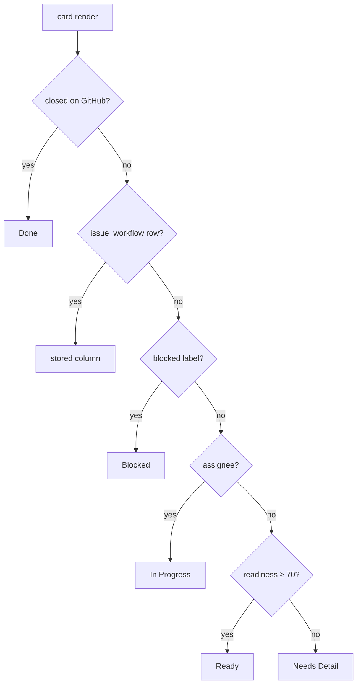

# Kanban Board — Design (#9)

Date: 2026-07-20
Issue: [#9 Kanban board](https://github.com/patelmj/IssueLens/issues/9) — MVP 2, spec §8.
Status: approved in brainstorm; awaiting implementation plan.

## Summary

A per-repo Kanban board at `/plan/board` with the spec §8.1 workflow
(`Needs Detail → Ready → In Progress → Review → Blocked → Done`), optional
swimlanes by Component or Assignee, and developer-centric cards (spec §8.3).

Workflow state is **IssueLens-owned**: it never syncs to GitHub, matching the
data-ownership stance of priority pins. A card's column is **auto-derived from
GitHub signals at read time** unless the user has manually placed it, in which
case the manual placement is sticky — with one exception: a closed issue always
displays in Done.

## Decisions (settled in brainstorm)

| Question | Decision |
|---|---|
| Source of truth for column | IssueLens-owned table; never written to GitHub |
| Manual drag vs later signals | Sticky manual; closed-on-GitHub always wins (display-level); reopen falls back to stored column |
| Where derivation runs | Read-time in the API endpoint; only manual placements are persisted |
| Swimlanes this slice | None (flat default) + Component + Assignee |
| Board scope | Per-repo, like the matrix |

## Data model

New table `issue_workflow` (Alembic migration 0008):

| Column | Type | Notes |
|---|---|---|
| `issue_id` | BigInteger PK, FK → `issues.id`, `ondelete=CASCADE` | one row per manually-placed issue |
| `column` | Text | CHECK constraint: `needs_detail`, `ready`, `in_progress`, `review`, `blocked`, `done` |
| `moved_at` | DateTime(tz) | server default now, updated on each move |

A row exists **only** for manually-placed cards. Auto-derived placement is never
persisted. Deleting the row returns the card to auto-derivation.

## Column derivation (read-time, first match wins)

For open, non-PR issues with no `issue_workflow` row:

1. Issue closed → `done` (only relevant for the Done column query)
2. Any label named `blocked` (case-insensitive) → `blocked`
3. At least one assignee → `in_progress`
4. Readiness score ≥ 70 → `ready`
5. Otherwise → `needs_detail`

Rules:

- **Review is manual-only this slice.** We do not sync linked-PR data, so there
  is no signal to derive it from. Follow-up issue at plan time.
- **Closed-wins for placed cards:** if a manually-placed issue is closed on
  GitHub, it displays in Done; the `issue_workflow` row is retained, so
  reopening returns it to its stored column.
- **Done column contents:** issues closed within the last 14 days (bounded so
  the column doesn't grow forever), plus any open issue manually placed in
  `done`.

## API — `backend/app/routers/kanban.py`

- `GET /repositories/{repo_id}/kanban`
  Joins `issues` + `issue_classifications` + `issue_readiness` +
  `issue_priority` + `issue_workflow`. Returns cards grouped by column.
  Card payload: `number`, `title`, `component`, `issue_type`, `priority_band`,
  `readiness_pct`, `estimate` (same 1–5 derivation the matrix uses: `size/*`
  labels else readiness gap), `assignees`, `gh_updated_at`, `warning` (top
  readiness missing-item, if any), `placed` (bool — manual vs derived).
- `PUT /issues/{issue_id}/workflow` body `{"column": "<value>"}`
  Upserts the manual placement. Invalid column → 422. This is what a drag calls.
- `DELETE /issues/{issue_id}/workflow`
  Removes the manual placement (card returns to auto-derivation). 204 on
  success, mirroring the pin/unpin endpoint shape.

## Frontend — `/plan/board`

- Segmented plan tabs become **Table | Matrix | Board** (repo-aware, same
  pattern as the matrix), plus a Board sub-link in the sidebar.
- Six fixed columns in workflow order. Columns are always visible; empty ones
  render muted, never hidden.
- **Lane-by switcher:** None (default) | Component | Assignee. Lanes render as
  horizontal swimlane rows × workflow columns (spec §8.2 example layout).
  A card lives in exactly one lane: by first assignee when laning by Assignee
  (extra assignees still listed on the card), with `Unassigned` / `Uncategorized`
  fallback lanes rendered last for missing assignee/component.
- **Cards** (spec §8.3 minus dependencies and PR line — that data isn't synced
  yet; dropped this slice): `#number title`, `Component · Type · P-band`,
  readiness %, estimate, updated-ago, ⚠ warning line when readiness reports a
  top missing item. Manually-placed cards get a subtle "placed" affordance and
  a context action **Reset to auto**.
- **Drag:** pointer-event based, same pattern proven in the matrix
  (pointercancel-safe). Optimistic column move; on API failure, revert and
  toast. Keyboard parity: select a card, then a move-to-column action.

## Error handling

- PUT/DELETE failures roll back the optimistic move and show a toast.
- 204 responses handled by the existing `getJson` (fixed in slice 8).
- Unknown repo / issue ids → 404 from the API, surfaced as toast.

## Testing

- **Backend (pytest):** table-driven tests for the derivation ladder;
  sticky-manual + closed-wins + reopen-fallback semantics; endpoint tests for
  GET grouping, PUT upsert/validation, DELETE reset; Done-column 14-day bound.
- **Frontend (Playwright CLI, stateful stub):** drag between columns issues the
  PUT and persists across reload; lane-by switching; reset-to-auto; keyboard
  move; tabs/sidebar navigation.
- Lint (ruff, eslint) + `npm run build` as usual; live verification on dogfood
  data before PR.

## Out of scope (file as follow-up issues at plan time)

- Review-column auto-derivation from linked PRs (needs PR-link sync)
- Dependency counts on cards (needs dependency data)
- Swimlanes beyond Component/Assignee (Priority, Milestone, Issue type, …)
- Any GitHub Projects or workflow-field write-back to GitHub
