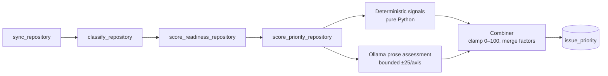

# Slice 8 — Priority Matrix (hybrid urgency/importance scoring → draggable scatter + execution queue)

**Issue:** #10 · Area: Views & Visualization · P1
**Spec references:** §10 Priority Matrix, §10.1 Computed Axes, §10.2 Draggable Placement, §10.3 Symbol Encoding, §10.4 Interactions, §21.2 MVP 2
**Builds on:** slice 5 classification (`issue_classifications`), slice 6 readiness (`issue_readiness` factors pattern), the arq worker chain (`sync → classify → score_readiness`), and the sketch-validated visual direction (sketch 001, Variant D — see `sketch-findings-issuelens` skill).

---

## 1. Goal

An interactive Eisenhower-style scatter over open issues:

1. **Hybrid urgency/importance scoring** — 0–100 per axis, deterministic signals + one bounded Ollama assessment, every placement explainable via signed factors.
2. **Continuous draggable scatter** — quadrant-tinted SVG chart; dragging pins an issue (IssueLens-owned, never synced to GitHub); pinned issues show a dashed ring and can be released back to AI placement.
3. **Execution queue** — a live-ranked right-rail list grouped by quadrant (Do First → Schedule → Delegate → Reconsider); drag re-ranks with flash highlights; bubble ↔ row click-to-locate. Ships with the matrix, non-negotiable.
4. **Explainability popover** — §10.1-style card with signed factor lines, LLM-derived factors visually tagged.

### Non-goals (explicitly deferred — filed as `/todos` at wrap-up)

- Filter chips (repository / type / readiness range)
- "Propose priority change" on quadrant-crossing drags (GitHub write path)
- Zoom/pan and overlap clustering
- Lasso multi-select + bulk actions
- Saved matrix views
- Milestone due-date sync (would sharpen the urgency axis)
- Dependency graph / blocks-count signals (§10.1 lists them; we don't have the data yet)

---

## 2. Key decisions (locked in brainstorming)

| Decision | Choice | Rationale |
|---|---|---|
| Scoring | **Hybrid**: deterministic base from structured signals + bounded LLM adjustment (±25/axis) from prose | Cheap, mostly reproducible, still catches "customer reported a regression" stated only in text |
| Architecture | **Pipeline parity**: new arq job chained after readiness, persisted tables | Only option satisfying §10.2 pin persistence + explainability; mirrors proven classify/readiness blueprint |
| Scope | **Core only**: scatter, drag-to-pin, queue, click-to-locate, hover card, explainability | Sketch-validated core; everything else deferred to board todos |
| Placement | **Tab under Plan** (`/plan/matrix`), segmented control Table \| Matrix | Matches sketch title row; Kanban board joins the control later |
| LLM failure | **Heuristic-only fallback**, `model="heuristic-only"`, logged | Matrix still works without Ollama; errors surfaced, not swallowed |
| Explanation delivery | **Factors folded into the list payload** — no separate explanation endpoint | Factors are small; one less round trip |
| Effort (bubble size) | Integer 1–5: `size/*`-style labels when present (XS→1 … XL→5), else readiness-gap fallback `clamp(round((100 − readiness_score) / 20), 1, 5)`, default 3 when unscored | No estimate field exists yet; size must NOT encode importance (already the y-axis); 1–5 keeps `r = 8 + effort × 2.1` in the sketch-validated 10–18.5px range |

---

## 3. Data model — one Alembic migration

### `issue_priority` (mirrors `issue_readiness`)

| Column | Type | Notes |
|---|---|---|
| `issue_id` | BigInteger PK, FK → `issues.id` CASCADE | |
| `urgency` | Integer | 0–100 |
| `importance` | Integer | 0–100 |
| `factors` | JSONB list | `{axis: "urgency"\|"importance", sign: "+"\|"-", text, source: "signal"\|"llm", weight}` |
| `model` | Text | Ollama model id, or `"heuristic-only"` |
| `scored_at` | DateTime(tz) | server default now |
| `issue_gh_updated_at` | DateTime(tz) | staleness key, same convention as readiness |

### `issue_priority_pins` (IssueLens-owned, §10.2)

| Column | Type | Notes |
|---|---|---|
| `issue_id` | BigInteger PK, FK → `issues.id` CASCADE | |
| `pinned_urgency` | Double | 0–100 |
| `pinned_importance` | Double | 0–100 |
| `created_at` | DateTime(tz) | server default now |

Re-analysis writes `issue_priority` and **never** touches pins. Pins never sync to GitHub.

---

## 4. Scoring pipeline — `backend/app/llm/priority.py` + worker job

- New arq job `score_priority_repository(ctx, repo_id)` enqueued by `score_readiness_repository` with `_job_id=f"priority-{repo_id}"` (same dedup pattern).
- Scope: **open, non-PR** issues whose `gh_updated_at` is newer than the stored `issue_gh_updated_at` (idempotent; closed issues excluded — the `08dec57` lesson).

### Deterministic signals (pure functions, table-driven-testable)

Urgency:
- Age relative to priority label (`P0`/`P1`/`P2` labels; P0 aging fast beats P2 aging slow)
- Staleness of `gh_updated_at`
- Milestone assigned (+; absence adds urgency uncertainty per §10.1's example)
- Recent comment activity (`comments_count` + recency)

Importance:
- Priority label (strong signal when present)
- Component criticality from `issue_classifications.component` (auth/api/infra > docs)
- Readiness score availability
- Label signals: `regression`, `customer`, `security`

### LLM assessment (one Ollama call/issue, same client as readiness)

Reads title + body; returns bounded adjustments with factor texts for prose-stated customer/user impact, regression claims, blast radius. Combiner: base from signals, LLM adjustment clamped to ±25/axis, final clamp 0–100, merged factor list. Ollama failure → persist heuristic-only result, log the error.

---

## 5. API — `backend/app/routers/priority.py`

| Endpoint | Behavior |
|---|---|
| `GET /api/repositories/{repo_id}/priority` | Matrix payload: open non-PR issues ⋈ priority ⋈ pins ⋈ classification ⋈ readiness. Per item: `issue_id`, `number`, `title`, `urgency`, `importance`, `factors`, `issue_type`, `component`, `readiness_score`, `labels`, `assignees`, `estimate`, `pinned` (+ coords), `scored_at`. Unscored issues return `urgency/importance: null` (UI shows "scoring in progress", never silently omits). |
| `PUT /api/issues/{issue_id}/pin` | Body `{urgency, importance}` (0–100 floats). Upsert. Returns updated item. 404 unknown issue, 422 out-of-range. |
| `DELETE /api/issues/{issue_id}/pin` | Release back to AI placement (§10.2). |

No GitHub writes anywhere in this slice.

---

## 6. Frontend — `/plan/matrix`

`/plan` title row gains the sketch's segmented control (**Table | Matrix**); `/plan/matrix` is its own deep-linkable route sharing the Plan toolbar shell.

> ⚠ Implementers MUST read `frontend/node_modules/next/dist/docs/` first — this Next.js version has breaking changes (per `frontend/AGENTS.md`).

Components under `frontend/src/app/plan/matrix/`:

| Component | Responsibility |
|---|---|
| `page.tsx` + `matrix-client.tsx` | React Query fetch (same pattern as `plan-client.tsx`), selection/pin state, orchestrates chart + queue |
| `matrix-chart.tsx` | Inline SVG (`viewBox 0 0 860 560`, margins l52 r18 t18 b46). Quadrant tints .05 (light)/.10 (dark) alpha — Schedule blue, Do First red, Delegate aqua-green, Reconsider gray — uppercase muted corner labels. Bubble `r = 8 + effort × 2.1` (size = effort, NEVER importance). Validated 4-type palette, mode-stepped; >4 types fold to "Other". Every bubble: ink `#number` label with surface-stroke halo + 2px surface ring (light-mode contrast requirement). Drag: pointer events, `setPointerCapture` in try/catch, 3px threshold click-vs-drag. Pinned: dashed ring `stroke-dasharray: 4 3` + toast with **Release to AI**. Unscored issues: muted "N issues awaiting scores" chip |
| `execution-queue.tsx` | Right-rail card (330px column): quadrant groups ranked by `urgency + importance`; drag-end re-rank with `rowflash` animation; bubble click → scroll-to + flash row; row click → highlight bubble |
| Explainability popover | §10.1-style card: `#182 — Urgency 84 / Importance 76` + signed factor lines; LLM factors tagged |

Rules: all colors via theme tokens with Tailwind v4 **paren** syntax `bg-(--color-X)`; dual theme via existing `data-mode`; `all .15s ease` transitions; pin mutations optimistic with rollback on error (triage-push pattern).

---

## 7. Error handling

- Ollama down → heuristic-only scores persisted, `model` records it, error logged.
- Pin PUT/DELETE fails → optimistic update rolls back + toast.
- Repo unsynced/empty → existing empty-state pattern.
- Out-of-range pin coords → 422, never clamped silently.

## 8. Testing

- **Backend (pytest):** combiner + deterministic signals (table-driven, pure functions), staleness/idempotency (unchanged issue not rescored), closed-issue exclusion, pin upsert/delete + validation, heuristic-only fallback when Ollama client errors.
- **Frontend (Playwright CLI, per CLAUDE.md):** matrix renders bubbles from the test DB; drag pins an issue (dashed ring appears, queue reflows with flash); Release-to-AI restores computed position; bubble↔queue click-to-locate; explainability popover shows signed factors; theme toggle re-renders chart colors.
- Full suite + lint before PR (per CLAUDE.md workflow).

## 9. Delivery workflow

Branch `feat/priority-matrix`; subagent-driven execution with house model tiering; pause before opening the PR (per CLAUDE.md PR-based review methodology); deferred features filed on the IssueLens Roadmap board via `/todos` at wrap-up.
