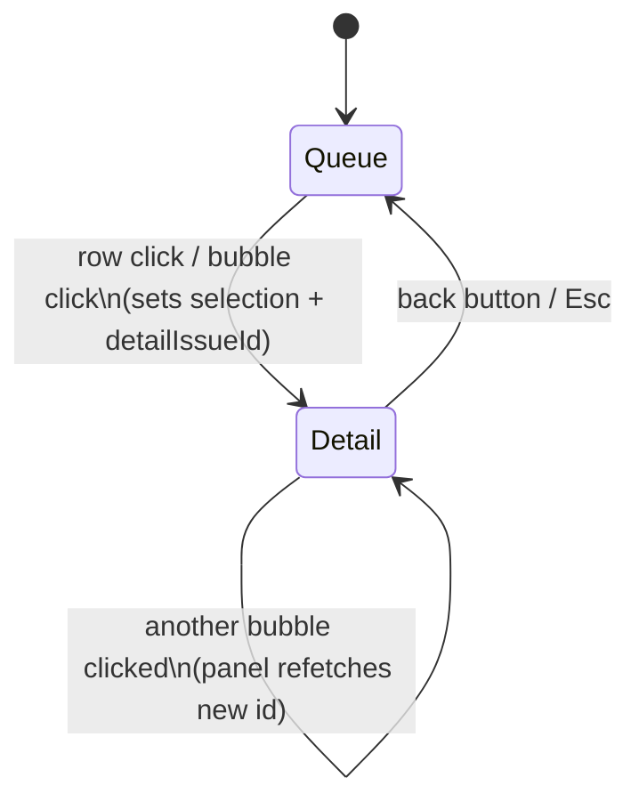

# Repo Visibility Toggles (#55) + Issue Detail Drawer (#52) — Design

**Date:** 2026-07-22
**Issues:** [#55](https://github.com/patelmj/IssueLens/issues/55), [#52](https://github.com/patelmj/IssueLens/issues/52)
**Status:** Approved pending user spec review

Two P1 slices shipped together on one branch. Part 1 adds include/exclude
visibility toggles for connected repositories, respected by every repo select
and aggregate query. Part 2 makes clicking an execution-queue row (or matrix
bubble) open an issue detail drawer in the right rail — the first incarnation
of the app-wide issue detail surface promised by spec §10.4/§12.

Decisions made during brainstorming:

- Visibility toggles live on the existing `/repositories` page — no `/settings` route yet.
- Detail surface is the **right-rail drawer** (option A of the mockups): the 330px
  rail swaps from the execution queue to the detail panel.
- Scope of the detail content is "core detail, no comments": everything already in
  the DB, no comment syncing, no similar-issues endpoint.
- A single click on a queue row (or bubble) **opens** the drawer; ← back / Esc returns.
- Issue body renders as **markdown** via `react-markdown` + `remark-gfm` (dependency approved).

---

## Part 1 — Repository visibility toggles (#55)

### Data model

- New column on `repositories`: `visible BOOLEAN NOT NULL DEFAULT TRUE` (server default
  `true` so existing rows stay visible).
- Alembic migration `0012_repository_visible.py`, hand-written following the
  `0011_saved_view_position.py` pattern (no autogenerate).
- **Hidden repos keep syncing.** Visibility is presentation-only: sync jobs, webhooks,
  and scoring pipelines ignore the flag entirely. Hide, don't disconnect.

### API (`backend/app/routers/repositories.py`)

- `RepositoryOut` gains `visible: bool`.
- `GET /repositories` gains query param `include_hidden: bool = False`. The default
  response **excludes hidden repos**, so every existing consumer of the shared
  `["repositories"]` query (sidenav, plan toolbar, matrix select, board filters) is
  filtered with no client-side changes. Only the `/repositories` management page
  requests `?include_hidden=true`.
- New `PATCH /repositories/{repo_id}` with body `{"visible": bool}` → returns the
  updated `RepositoryOut`. 404 if the repo doesn't exist. This is the only mutation.

### Aggregate query filtering (server-side)

Wherever an issue/repo query is *not* explicitly scoped to a single `repo_id`, it
filters to visible repositories:

- `stats.py` — repository count, issue counts, and `top_repos` join on
  `Repository.visible.is_(True)`.
- `issues.py::_filtered_query` — when `repo_id` is `None`, join `Repository` and
  filter visible. The facets endpoint goes through the same helper.
- Triage inbox queries — same treatment: unscoped lists span visible repos only.

Explicit single-repo requests (`repo_id` given, `/repositories/{id}/priority`,
`/issues/{id}/...`) are **not** blocked for hidden repos — the flag hides repos from
selects and aggregates; it does not firewall the data.

### Frontend

- `/repositories` (`repositories-client.tsx`): each repo card gets a visibility
  toggle (switch with an eye label). Hidden repos stay in the list but muted
  (reduced-opacity treatment on the card body — the card itself stays present and
  full-shape, per the house rule against hiding inactive elements). The page
  fetches with `include_hidden=true` under its own query key
  `["repositories", "all"]`.
- Toggle fires the PATCH via a React Query mutation, then invalidates both
  `["repositories", "all"]` and `["repositories"]` plus `["stats"]`, so the sidenav,
  toolbars, and overview refresh immediately. Mutation errors surface inline on the
  card (no silent failure).
- `Repo` type in `frontend/src/lib` gains `visible`.

### Edge case: stale `repo_id` in the URL

If a URL carries the `repo_id` of a now-hidden repo, the repo is absent from the
filtered `["repositories"]` list, so views take their existing "unknown repo"
paths: the matrix falls back to `repos[0]` (its current default), and the plan
table/board fall back to "All repositories". No special-case code — just verify
with a test.

---

## Part 2 — Issue detail drawer (#52)

### Backend: `GET /issues/{issue_id}`

New endpoint in `issues.py` returning `IssueDetailOut` — one payload joining
`Issue` + `IssueClassification` + `IssuePriority` + `IssueReadiness`:

| Block | Fields |
|---|---|
| Core | `issue_id`, `number`, `title`, `body` (raw markdown, nullable), `state`, `author_login`, `gh_created_at`, `gh_updated_at`, `gh_closed_at`, `repo_full_name`, `html_url` (constructed `https://github.com/{full_name}/issues/{number}`), `comments_count`, `milestone_title` |
| Labels/people | `labels: [{name, color}]`, `assignees: [login]` |
| Classification | `issue_type`, `component`, `classification_confidence` (nullable block if unclassified) |
| Priority | `urgency`, `importance`, `factors: PriorityFactor[]` (nullable if unscored) |
| Readiness | `readiness_score`, `factors: [{requirement, points, present, evidence}]` (nullable if unscored) |

404 if the issue doesn't exist. Intelligence blocks are independently nullable —
the drawer renders whatever exists rather than failing on partially-scored issues.

**Out of scope:** comment bodies (not synced — only a count exists), similar/related
issues (no endpoint), and any write actions. These are later slices of spec §12.

### Frontend: reusable `IssueDetailPanel`

- New component `frontend/src/components/issue-detail-panel.tsx`. Props:
  `{ issueId, onBack }`. Self-fetches with query key `["issue-detail", issueId]`
  (the `ReadinessDrawer` pattern). Explicit loading skeleton and error state with
  retry — no swallowed errors.
- Layout (narrow, single-column, design-token classes throughout, works in both
  themes): back header (`← Queue` + `#182 · Open · @sam · 2d ago`), title, label
  chips + assignees, markdown body, then the intelligence stack — readiness meter
  with the missing-requirements list, classification line, priority factor list —
  and a persistent "Open on GitHub ↗" link at the bottom.
- Body renders via `react-markdown` + `remark-gfm` (GFM tables/task-lists/strikethrough).
  Raw HTML in bodies is not rendered (react-markdown's safe default). Markdown
  elements styled manually with token classes — no typography plugin dependency.
- The component has no matrix imports, so table/board/triage can mount it in their
  own containers later — the reusability #52 exists to seed.

### Matrix integration

- `matrix-client.tsx` gains `detailIssueId: number | null` state. When set, the
  right rail renders `IssueDetailPanel` instead of `ExecutionQueue` (same
  `RightRail` portal slot).
- Queue row click → selects/locates the bubble (existing behavior) **and** sets
  `detailIssueId`. Matrix bubble click → same (spec §10.4: click opens the detail
  view). Drag continues to work unchanged — drag and click are already
  distinguished by the existing pointer handling.
- ← back or Esc clears `detailIssueId`, restoring the queue with the selection
  (and its scroll-into-view highlight) intact.

---

## Testing

**Backend (pytest):**
- PATCH visibility happy path + 404; `GET /repositories` default vs `include_hidden`.
- Stats and unscoped issues/facets/triage queries exclude hidden repos; explicit
  `repo_id` scoping still works for a hidden repo.
- `GET /issues/{id}`: full payload, partially-scored issue (null blocks), 404.

**Frontend (Playwright CLI):**
- Toggle a repo hidden on `/repositories` → it disappears from the plan toolbar
  select and the overview counts change; toggle back restores it.
- Stale hidden `repo_id` URL falls back cleanly on matrix and table.
- Matrix: queue row click opens the drawer with title, rendered markdown body, and
  readiness meter; back restores the queue with the same row highlighted; Esc works;
  bubble click opens the drawer too.

## Out of scope

- Dedicated `/issues/[id]` route, comments, similar issues, action buttons
  (Generate questions / Suggest rewrite / Create sub-issues) — later spec §12 slices.
- A `/settings` page — revisit when there's more than one setting.
- Auth/user-scoping of visibility (workspace-scoped until #32 lands).
