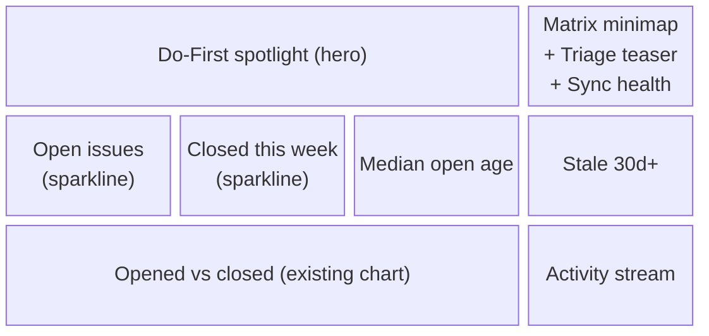

# Overview Page Overhaul — Design (#50)

**Date:** 2026-07-23
**Issue:** [#50 Overview page UI overhaul](https://github.com/patelmj/IssueLens/issues/50)
**Status:** Approved (brainstorm 2026-07-23, layout picked via visual companion)

## Purpose

The Overview landing page currently shows four flat stat tiles, an opened-vs-closed
chart, and a repo list — accurate but dull, and it answers no question in particular.
The overhaul gives the page a **balanced split** voice: a "do this next" hero plus an
equally weighted health/trends layer, inside the established design language (layered
surfaces, indigo accent, dual theme, everything responds).

Decided during brainstorm:

- **Page purpose:** balanced split — action hero + health band, neither dominates.
- **Layout skeleton:** Option B "Do-First hero leads" (chosen from three mockups).
- **Spotlight click:** opens the #52 issue detail drawer in place on the Overview.
- **Deletion:** the "Repositories" list card and "Biggest repo" tile leave the page —
  repo navigation lives in the sidebar and /repositories.
- **Additions (second brainstorm pass):** a live matrix minimap in the hero side
  stack and a stale-work stat tile in the health band.

## Page Skeleton

Three bands, top to bottom (desktop; bands stack on narrow viewports):



All cards keep the standard treatment: 14px radius, `--color-surface`,
`--color-border`, `--shadow-card`, tokens only — no hardcoded colors.

## Components

### Do-First spotlight (hero, ≈2/3 width)

- Top **4** open issues in the matrix's **Do First** quadrant, ordered by priority
  score descending.
- Each row: type-colored dot **sized by estimate** (same `radiusOf(estimate)`
  visual language as matrix bubbles), issue title, repo short name, readiness
  mini-bar, relative age.
- Card treatment: subtle red-wash gradient (`--quad-dofirst-strong` at low alpha
  fading into surface) + a do-first accent edge; "View matrix →" link in the header.
- **Click row → issue detail drawer** (the #52 component) slides in on the Overview,
  same behavior as on /plan.
- **Empty state:** card stays visible and muted (never hidden): "Nothing in
  Do First — see Schedule", linking to the matrix.

### Side stack (≈1/3 width)

- **Matrix minimap (top of stack):** a small non-interactive thumbnail of the
  priority matrix — the four quadrant washes (`--quad-*-strong` at reduced alpha)
  plus one dot per prioritized open issue at its urgency/importance position,
  colored by the `--pm-*` palette and faintly sized by estimate. No labels, no
  drag, no tooltips; the whole card is a single click target → /plan. It sits
  directly beside the Do-First spotlight and visually explains where that list
  comes from. Empty state: washes only, muted "No prioritized issues yet".
- **Triage teaser:** count of issues awaiting triage (same predicate as the /triage
  inbox list — one number, one source of truth) + readiness bars for the top 3;
  the whole card links to /triage. Empty state: "Queue clear" muted.
- **Sync health:** status line (healthy / syncing / error from latest SyncJob),
  last-synced relative time, visible-repo count. Live via the existing 30s refetch.

### Sparkline stat tiles (health band)

| Tile | Value | Extra |
|---|---|---|
| Open issues | current count | 30-day trajectory sparkline + week-over-week delta arrow |
| Closed this week | count | delta vs previous week |
| Median open age | days | no sparkline |
| Stale 30d+ | open issues with `gh_updated_at` older than 30 days | no sparkline; uses the existing `ix_issues_gh_updated_at_not_pr` index |

Open-issue trajectory is derived server-side: current count walked backwards
through the daily opened/closed net — no schema change. Delta arrows use
`--type-bug` red for worsening, `--chart-closed` green for improving.

### Depth row

- **Opened vs closed chart:** the existing `ActivityChart`, unchanged, ≈2/3 width.
- **Activity stream:** last ~8 events interleaved from existing data — issue opened,
  issue closed, sync completed — each with icon, one-line text, relative time.

## Data Layer

`GET /stats/overview` is **extended in place** (`backend/app/routers/stats.py`);
the frontend keeps its single `overview-stats` query with 30s refetch. New response
fields alongside the existing ones:

```
do_first:        [{issue_id, number, title, repo_short, type, effort, readiness, score}]  # top 4
triage:          {count, top: [{readiness}]}                                              # top 3 bars
sync:            {status: "healthy"|"syncing"|"error", last_synced_at, visible_repos}
open_trend:      [int]        # 30 daily points, derived from current count + activity net
closed_week:     {count, delta}
median_age_days: float | null
stale_count:     int          # open, not PR, gh_updated_at > 30 days old
minimap:         [{u, i, type, estimate}]   # all prioritized open issues, compact
events:          [{kind: "opened"|"closed"|"synced", text, at}]                           # last 8
```

Sources: `IssuePriority` (quadrant + score), `IssueReadiness` (bars),
`SyncJob` (sync status + synced events), `Issue.gh_created_at/gh_closed_at`
(activity, ages, trend). All queries respect `Repository.visible` and exclude PRs,
matching the existing endpoint's filters. No new tables, no new endpoints.

## States & Motion

- **No connected repos:** the existing connect-CTA empty state is kept as-is.
- **Backend unavailable / loading:** existing card states kept.
- **Load-in:** subtle staggered card fade from the matrix pop-in family
  (`matrix-fade-in`-style, small per-card delay), honoring
  `prefers-reduced-motion`.
- All hover/interactive transitions `all .15s ease`, consistent with the shell.

## Testing

- **Backend:** endpoint tests for each new field — populated case, empty-data case
  (no priorities / no readiness / no sync jobs), hidden-repo exclusion, PR exclusion.
- **Frontend (Playwright):** spotlight renders top Do-First issues and clicking a row
  opens the detail drawer on the Overview; triage teaser navigates to /triage;
  minimap renders dots and clicks through to /plan; empty states render
  visible-but-muted; stat tiles show sparklines, deltas, and the stale count.
- Full suite + lint before PR, per house workflow.

## Out of Scope

- Team-level analytics (#15) and completed-work analytics (#58).
- Any triage flow changes (#57, #56).
- New prioritization logic — the page only reads what the matrix already computes.
