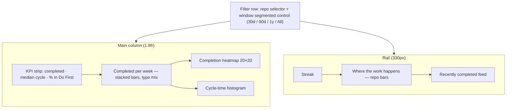

# Completed-Work Analytics — personal "what have I finished" page

**Issue:** #58 (Completed-work analytics page + matrix completion heatmap)
**Date:** 2026-07-24 · **Status:** approved design, pre-implementation
**Related:** #15 (team-level delivery analytics — separate, cross-referenced, not merged)

## Goal

Replace the `/analyze` placeholder with a personal, **cross-repo** completed-work
page. All metrics aggregate every connected repo's issues by default; a repo
filter narrows every card at once. Read-only over already-mirrored data — **no new
tables, no sync changes**.

## Decisions (validated interactively, 2026-07-24)

| Decision | Choice |
|---|---|
| Modules | Velocity + type mix, matrix completion heatmap, cycle time, streaks + recent feed, repo distribution |
| Snapshot persistence | **Deferred** — no readiness-at-close or workflow-transition logging in this slice (future work, see #15) |
| Layout | **C — charts + 330px feed rail** (matches matrix-queue / overview side-stack pattern), refined v4 |
| Heatmap granularity | **20×20 bins** (5-point) over the 0–100 urgency × importance space |
| Explainability | ⓘ explainer popover on every KPI and card title; value tooltip on every mark |
| Repo distribution | "Where the work happens" rail card — single-hue horizontal bars, top 3 + Other |

## Page layout (C-v4)



## API — one endpoint

`GET /analytics/completed?window=30d|90d|1y|all&repo_id=<optional>`

```json
{ "totals": {"completed": 47, "median_cycle_days": 6.5, "p90_cycle_days": 21,
             "do_first_pct": 62, "streak_weeks": 5},
  "weekly": [{"week_start": "2026-07-06", "bug": 5, "feature": 3, "debt": 1, "other": 0}],
  "heatmap": [{"u_bin": 15, "i_bin": 16, "count": 3, "sample_issues": [142, 118, 109]}],
  "cycle_buckets": [{"label": "0–1d", "count": 4}],
  "repos": [{"full_name": "patelmj/IssueLens", "count": 27, "pct": 58}],
  "streak": {"weeks": [{"week_start": "...", "count": 2}], "current": 5},
  "recent": [{"number": 142, "title": "...", "repo": "...", "type": "bug",
              "quadrant": "do_first", "cycle_days": 4.2, "closed_at": "..."}] }
```

**Definitions:**

- **Population:** closed, non-PR issues with `gh_closed_at` inside the window.
- **Type:** from `issue_classifications`; `question`/`docs`/unclassified fold into
  `other` (4th series — respects the 4-series categorical cap).
- **Heatmap:** `issue_priority` with `issue_priority_pins` overrides; issues
  without a priority row are skipped. 20×20 bins; `sample_issues` ≤ 3 per bin.
- **`do_first_pct`:** share of prioritized completions with urgency ≥ 50 and
  importance ≥ 50.
- **Cycle buckets:** 0–1d, 1–3d, 3–7d, 7–14d, 14–30d, 30d+ on
  `gh_closed_at − gh_created_at`.
- **Streak:** consecutive weeks ending at the current week with ≥ 1 completion;
  `weeks` returns the last 12 for the rail dots.
- **Repos:** every repo with ≥ 1 completion in window; the UI folds to top 3 +
  "Other (n)".
- **Recent:** last 8 completions.

## Backend

- `app/analytics/completed.py` — one small aggregation function per module
  (window resolution, weekly bucketing, heatmap binning with pin override,
  cycle bucketing, streak, repo grouping, recent feed), composed by the router.
  SQL aggregation; no Python loops over full row sets.
- `app/routers/analytics.py` — the endpoint + Pydantic response models.

## Frontend

- `analyze/page.tsx` server shell + `analyze-client.tsx` (triage/plan pattern);
  React Query on the single endpoint; URL-param filters (`window`, `repo_id`)
  like the triage toolbar.
- **Hand-rolled SVG/CSS chart components — no chart library, no new deps:**
  `velocity-chart.tsx`, `completion-heatmap.tsx`, `cycle-histogram.tsx`, plus
  rail cards (streak, repo bars, feed) and a shared KPI tile.
- All colors through theme tokens, both modes, dark default.

### Chart colors (dataviz-validated 2026-07-24)

- **Sequential indigo ramp** (heatmap fills, histogram bars, repo bars):
  - Light (surface `#ffffff`): `#a2a2eb → #8585e0 → #6868d3 → #4f4fc0 → #3a3aa0`
  - Dark (surface `#17171b`): `#45457a → #5757a5 → #6b6bc8 → #8484e5 → #a5a5f7`
  - Both pass the ordinal validator (monotone L, ΔL ≥ 0.06, light-end ≥ 2:1).
  - Zero-count heatmap cells render as surface with hairline border, not ramp.
- **Type-mix series:** existing validated palette — Bug `#2a78d6`/`#3987e5`,
  Feature `#008300`, Debt `#e87ba4`/`#d55181`, Other (task amber)
  `#eda100`/`#c98500` (light/dark). Legend present; direct labels per palette
  conditions.
- Heatmap normalizes ramp steps to the max bin count in view. With ~50
  completions most bins hold 1–2 issues; if the map reads thin in practice, a
  bin-size toggle is a possible follow-up (not in this slice).

## Interaction & explainability

- **Value tooltips on every mark:** heatmap cell ("urgency 75–80 · importance
  80–85 — 3 completed: #142, #118, #109"), velocity bar ("Week of Jul 7 — 9
  completed: 5 bug · 3 feature · 1 debt"), histogram bucket, feed row.
- **ⓘ explainer popovers** on each KPI and card title with fixed copy defining
  the metric and how it's computed (frontend constants; e.g. median cycle:
  "Days from GitHub creation to close, across issues closed in the selected
  range. Half your completions were faster than this.").
- Feed rows and tooltip issue numbers open the existing issue detail drawer.
- Filter changes re-query; cards fade/settle (`all .15s ease`). No entrance
  animation theatrics.
- **Empty states:** empty window → per-card "No completions in this window";
  the page never blanks.

## Testing

- **Backend unit:** each aggregation — window edge inclusion, week bucketing
  across month/year boundaries, heatmap binning + pin override, type folding,
  streak boundaries (gap week, current-week-empty), repo grouping.
- **API:** response-shape test with seeded fixtures.
- **Frontend (Playwright):** seeded data renders all modules; filter changes
  update URL + cards; tooltip appears on hover; ⓘ popover opens; empty-window
  state renders.
- Full suite + lint before PR, per house rules.

## Out of scope / deferred

- Readiness-at-close snapshots and workflow-transition logging (needed for
  "do we finish ready work faster?" and triage→done cycle time) — future slice,
  coordinate with #15.
- Team-level delivery analytics → #15.
- Heatmap bin-size toggle.
