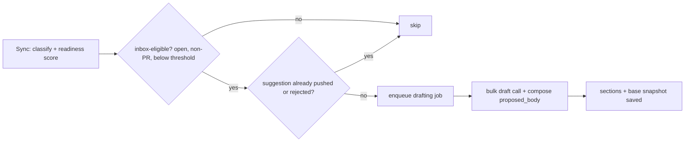

# Triage Suggestion v2 — AI draft answers + side-by-side proposal UI

**Issues:** #56 (AI-generated draft answers for template gaps), #57 (proposed-changes UI enhancement)
**Date:** 2026-07-24 · **Status:** approved design, pre-implementation

## Goal

Upgrade the triage suggestion flow from "empty scaffold proposal rendered as a raw
line diff" to:

1. **AI-drafted answers** for missing template sections, generated from the issue's
   own context via the local Ollama pipeline — grounded-only, never fabricated.
2. A **side-by-side original/proposed drawer** with per-section provenance, and
   per-section regenerate / steer / edit / remove actions.

The write-safety contract is unchanged: nothing reaches GitHub without an explicit
"Approve & push", and the existing base-body conflict check runs before every push.

## Decisions (validated interactively, 2026-07-24)

| Decision | Choice |
|---|---|
| Draft policy | **Grounded-only**: a section is drafted only when inferable from the issue thread; otherwise the empty scaffold placeholder stays |
| Draft marking | **Single footnote** at the end of the appended block naming the AI-drafted sections and the model used |
| Generation timing | **Pre-generated during sync/ingestion** for inbox-eligible issues; drawer opens are instant |
| Regeneration | **Per-section**, with an optional user "steer" prompt to guide the redraft |
| Storage | **Structured sections JSONB** on `IssueSuggestion`; `proposed_body` becomes derived |
| Prompt context | Issue thread + **repo card + cross-referenced issues** (see below) |
| Presentation | **Side-by-side (variant D)** with **per-section gap markers (D1)** on the original pane |
| Narrow fallback | Below ~720px panes stack into the **refined inline flow (variant A)** |

## Data model

`IssueSuggestion` gains a nullable `sections` JSONB column (legacy rows migrate
lazily on next generation):

```json
[{ "requirement_id": "repro_steps",
   "heading": "Reproduction Steps",
   "body_md": "1. Go to /login\n2. ...",
   "origin": "ai" | "scaffold",
   "model": "qwen3:8b" | null,
   "edited": false,
   "removed": false,
   "stale": false }]
```

- `origin: "ai"` — the LLM produced grounded content; `model` records which model.
- `origin: "scaffold"` — nothing inferable; `body_md` holds the existing scaffold
  placeholder (heading + guiding HTML comments) unchanged.
- `edited` — set when the user hand-edits the section body; edited sections are
  never overwritten by automatic redrafts.
- `removed` — excluded from composition; restorable from the UI.
- `stale` — set on an `edited` section when a re-sync changes the base body
  (un-edited sections are simply redrafted instead); cleared when the user edits
  or regenerates that section.

**Composition (server-side, deterministic).** `proposed_body` =
`base_body` + each non-removed section (`## heading` + body) + footnote. The
footnote appears only when ≥ 1 `origin:"ai"` section survives:

> `---`
> `*Sections "Reproduction Steps" and "Expected vs Actual" drafted by qwen3:8b from the existing report — please confirm or correct.*`

The push flow (`push_suggestion`) reads `proposed_body` exactly as today — the
conflict check, mirror update, re-score enqueue, and status transitions
(`draft → suggested/rejected → pushed`) are untouched.

## LLM drafting

New module following the existing Ollama pattern in `app/llm/`
(JSON-schema `format`, `temperature: 0`, `think: false`, normalize step, typed
`DraftError`):

- **Bulk call (sync path):** one call per issue drafts *all* missing sections.
  Output schema keyed by requirement id, each with `{grounded: bool, body_md}`.
  Ungrounded sections come back empty and are stored as `origin:"scaffold"`.
- **Targeted call (regenerate/steer path):** one section per call; the user's
  steer text is appended to the instruction ("The user adds: …").

**Prompt context:**

- Issue: title, body, labels, classification type, milestone.
- Comments: up to ~20 recent, **fetched live from GitHub at draft time** via the
  existing installation client (comments are not mirrored; read-only call, no new
  tables).
- **Repo card:** full name, description, primary language (mirrored data).
- **Cross-referenced issues:** any `#N` mentioned in body/comments is resolved
  from the local mirror (same repo only) to `title + state`. Cross-repo and
  unmirrored references are skipped in v1.

The prompt instructs: draft only what the context supports; prefer quoting or
tightly paraphrasing the reporter; set `grounded: false` rather than guessing.

## Sync integration



- Runs after readiness scoring in the classify pipeline for inbox-eligible issues.
- **Re-sync with changed base body:** un-edited AI sections are redrafted; edited
  sections are preserved and flagged stale in the UI; the base snapshot updates.
- Drawer race: if a user opens the drawer before the job lands, the drawer shows a
  "drafting…" state and polls/refetches.

## API

- `POST /issues/{id}/suggestion/sections/{requirement_id}/regenerate`
  body `{steer?: string}` — synchronous targeted redraft (frontend shows a
  per-section spinner). Blocked once `pushed`.
- `PATCH /issues/{id}/suggestion/sections/{requirement_id}`
  body `{body_md}` (sets `edited: true`) or `{removed: bool}`.
- `SuggestionOut` gains `sections`; the `diff` field is **removed** along with the
  UI's use of `build_diff` (the D presentation renders panes, not line diffs).
  Grep for all `diff` consumers when removing — tests reference
  `suggestion-diff` test ids.
- Existing generate endpoint (`POST /issues/{id}/suggestion`) now also runs the
  bulk draft call (manual "Regenerate all").

## UI — the drawer

Side-by-side **D + D1**, rendered with existing `react-markdown` + `remark-gfm`:

- **Left pane (Original):** dimmed rendered markdown of `base_body`; one dashed
  gap marker per proposed addition ("no ⟨Heading⟩ section"), vertically aligned
  with its counterpart.
- **Right pane (Proposed):** rendered markdown; each appended section is a
  green-washed block (`--type-feature`-derived wash, 3px left bar) with a chip:
  `AI DRAFT · <model>` (accent tint) or `SCAFFOLD` (muted outline). Stale-flagged
  sections show a small "base changed" hint. Footnote preview at the bottom.
- **Per-section actions (on hover):** `↻ Regenerate · ✎ Steer… · Edit · ✕ Remove`.
  *Steer* opens a popover (textarea + "Redraft section" / Cancel). *Edit* swaps
  the section body for an inline textarea (replaces the old whole-body textarea).
  *Remove* excludes the section (restorable via an "removed sections" affordance).
- **Global actions:** Approve & push / Reject / Regenerate all — unchanged
  semantics, same test ids where practical (`approve-push`, `push-error`).
- **Responsive:** below ~720px the panes stack into the variant-A inline flow
  (green-washed add blocks in one column). No separate design — same components.
- **Motion:** wash-flash on redraft completion (existing `rowflash` pattern),
  `all .15s ease` transitions, popover fade/scale. No entrance theatrics.

## Testing

- **Backend unit:** composition (footnote presence/wording, removed/edited
  interactions, heading dedup), grounded-only normalization (ungrounded → scaffold),
  sync eligibility rules (threshold, pushed/rejected skip), re-sync redraft
  preserving edited sections, conflict path with sections present.
- **API:** section PATCH/regenerate endpoints, including post-push lockout.
- **Frontend (Playwright, Ollama mocked at the API layer):** drawer renders panes
  + chips + footnote, steer popover redraft flow, edit/remove/restore, narrow
  viewport stacking, approve & push happy path and conflict banner.

## Out of scope / deferred

- "Ask issue author for details" comment action → #29.
- Drafting for issues already `pushed`/`rejected`.
- Cross-repo reference resolution in prompt context.
